# Pixel Run

This tutorial will take you through the basics of creating an endless runner using Ngine.

**Approximate time to completion:** 1 hour

You can download the assets we'll use in the tutorial [here](./tutorial_assets/assets.zip).

## Prerequisites

It's recommended that you have a passing familiarity with [Angular](https://angular.io/), [TypeScript](https://www.typescriptlang.org/), and [Reactive Programming (ReactiveX)](http://reactivex.io/) before you start working with Ngine.

This tutorial is accomplishable without this knowledge, but your mileage may vary.

## Setup

We'll use the Angular CLI to scaffold our application. This will save time and spare us needing to write build scripts.

Open up a terminal and execute

> npm install -g @angular/cli

to install the Angular CLI. Then

> ng new pixel-run

to create our project. This will take a little bit of time. Next, install Ngine and the Three.js and Matter.js packages:

> npm install --save @ngine/core @ngine/three @ngine/matter

Finally, copy the assets from the zip file linked above into `src/assets/`.

That's it! We're all ready to go!

## Include Ngine

Angular lets developers import Angular package dependencies via **modules**. In these modules we'll be declaring Ngine, as well as our components and any services we chose to write.

The CLI will already have created a root module for us, which is what Angular uses to start our game. Modify `src/app/app.module.ts` to import and include Ngine:

```typescript
import { BrowserModule } from '@angular/platform-browser';
import { NgModule } from '@angular/core';
import { FormsModule } from '@angular/forms';
import { HttpModule } from '@angular/http';

import { NgineModule } from '@ngine/core';
import { NgineThreeModule } from '@ngine/three';
import { NgineMatterModule } from '@ngine/matter';

import { AppComponent } from './app.component';

@NgModule({
  declarations: [
    AppComponent
  ],
  imports: [
    BrowserModule,
    FormsModule,
    HttpModule,
    // Don't forget these!
    NgineModule,
    NgineThreeModule,
    NgineMatterModule
  ],
  providers: [],
  bootstrap: [AppComponent]
})
export class AppModule { }
```

Notice `AppModule` specifies `AppComponent` in the `bootstrap` field. This is the component that Angular will use as the root of our game.

## Creating your first sprite

Lets create our 'player' sprite to start off with. We'll need to create a new component and a new file to put it in. We could do this ourselves, but the Angular CLI again saves us time:

> ng generate component player --inline-template --inline-style

This will generate a new folder `src/app/player/` and two files inside of it, `player.component.ts` and `player.component.spec.ts`. The `.spec` file is for testing, which is very important! You can remove it for now if you'd like, but we'll be covering testing in a future tutorial.

Let's open up `player.component.ts`. You should see something like this:

```typescript
import { Component, OnInit } from '@angular/core';

@Component({
  selector: 'app-player',
  template: `
    <p>
      player Works!
    </p>
  `,
  styles: []
})
export class PlayerComponent implements OnInit {

  constructor() { }

  ngOnInit() {
  }

}
```
For those of you who are unfamiliar with the anatomy of an Angular component, I'll break it down for you briefly.

The `@Component({ ... })` section is called a decorator, or sometimes an annotation. It provides metadata for a particular class. In this case, we're specifying:

* `selector` - the name we'll be able to use to create the component throughout our game
* `template` - the contents of our component. Right now this is HTML, which isn't supported by Ngine and would break our game. We'll change it shortly.
* `styles` - we can provide strings that determine the look of our component here. We'll come back to this later.

The class that the decorator is annotating is `PlayerComponent`. The class will contain the code for our player sprite. Notice it implements `OnInit` - that means that whenever the class is fully loaded Angular will run `ngOnInit` for us. This method should include our component's setup code.

Lets begin by emptying the template option in the decorator and removing the styles option completely:

```typescript
@Component({
  selector: 'app-player',
  template: ``,
})
```
Next we'll import some Ngine classes that we'll be using.

```typescript
import { AssetService, KeyService, SpriteStyle, StyleBinding } from '@ngine/core';
```
Angular uses a concept called **Dependency Injection** to insert instances of external classes into a component class. This is one of the things that makes Angular so great and easy to test - if you want to learn more about it, I'd highly recommend reading [this article](https://blog.thoughtram.io/angular/2015/05/18/dependency-injection-in-angular-2.html).

For now, you'll need to modify your `constructor` like so:

```typescript
export class PlayerComponent implements OnInit {

constructor(
  private assets: AssetService,
  private keys: KeyService,
  @StyleBinding() private style: SpriteStyle,
) { }

}
```

This "dependency injects" (or simply, "injects") three key Ngine classes:

* `AssetService` - we'll use this to load in images and sounds from our /assets directory.
* `KeyService` - we'll use this to get key input from our players
* `SpriteStyle` - we'll use this to change how our component is displayed

and places them on the PlayerComponent class so that we can refer to them using this, e.g.:

```typescript
this.assets.loadImages();
```

> #### ASIDE: on styling
> Remember how we removed the styles option from the decorator earlier? We could have specified basic display information for the component, like its position, in this option. Ngine provides SpriteStyle as an alternative. It's a class that contains properties and helper methods to make manipulating styles easier. To let Ngine and Angular know that this class will have our style-related information on it, we tack on the StyleBinding decorator.
> 
> This may seem like a lot of code for being able to configure the display of our sprite, but this setup maximizes testability and flexibility. For more on styling, see Ngine's documentation.

Now let's get to the real meat of our sprite and modify `ngOnInit`.

----

#### Load in our assets

To retrieve the player image we'll use `AssetService`. It couldn't be easier:

```typescript
ngOnInit () {
  this.assets
    .loadImages([ { path: '/assets/img/player.png' } ])
    .subscribe(([playerImage]) => {

    });
}
```

We specify a list of the images we want (in this case, just one) and pass it to `AssetService::loadImages`. When all of these assets are loaded, `AssetService` will run the code inside `.subscribe` and give us the images in a list that's ordered the same as our input.

#### Set the sprite to display those assets

Setting the image of our sprite component is as simple as adding one line:

```typescript
ngOnInit () {
  this.assets
    .loadImages([ { path: '/assets/img/player.png' } ])
    .subscribe(([playerImage]) => {
      this.style.image = playerImage.style;
    });
}
```

#### Handle key input from the user

Lets briefly add some basic key handling so that we can tell that our game is working:

```typescript
ngOnInit () {
  ...
  this.keys.keyDown.get('space').subscribe(() => {
    this.style.position.y += 10;
  });
}
```

Every time the player presses the `space` key, an event will be fired that moves our sprite's y position up by 10 units!

---

Altogether, your `player.component.ts` should look something like this:

```typescript
import { Component, OnInit } from '@angular/core';
import { AssetService, KeyService, SpriteStyle, StyleBinding } from '@ngine/core';

@Component({
  selector: 'app-player',
  template: ``,
})
export class PlayerComponent implements OnInit {

  constructor(
    private assets: AssetService,
    private keys: KeyService,
    @StyleBinding() private style: SpriteStyle,
  ) { }

  ngOnInit() {
    this.assets
      .loadImages([ { path: '/assets/img/player.png' } ])
      .subscribe(([playerImage]) => {
        this.style.image = playerImage.style;
      });

    this.keys.keyDown.get('space').subscribe(() => {
      this.style.position.y += 10;
    });
  }

}
```

Finally, we need to let our application know about our new player component and actually use it somewhere! Head over to `app.module.ts` and import the `PlayerComponent` class like so:

```typescript
import { PlayerComponent } from './player/player.component';
...

@NgModule({
  declarations: [
    AppComponent,
    // Add this line!
    PlayerComponent
  ],
  ...
})
...
```

> #### NOTE:
> If you used the Angular CLI to create the component, it should already be here!

This lets the module (and Angular) know that we'll use the selector `'app-player'` to create the `PlayerComponent` in our game. Now open up `app.component.ts`. We'll modify it to remove the unhelpful `templateUrl` and `styleUrls` decorator options and instead specify an inline-template that includes our player component's selector:

```typescript
@Component({
  selector: 'app-root',
  template: `
    <app-player></app-player>
  `
})
export class AppComponent {
}
```

*(You can also delete `app.component.css` and `app.component.html`. We won't be using them.)*

## Running the game

We've written a lot of code without seeing any results. Let's fix that!

Head back to the terminal and run:

> ng serve

The Angular CLI will build the application, and assuming there aren't errors, begin serving it to a local website! Open up the URL `localhost:4200` in a new browser tab.

> #### NOTE:
> This might take a little while the first time that the CLI is building the application. Rest assured, if you leave ng serve running in the background, updates will be lightning-quick!

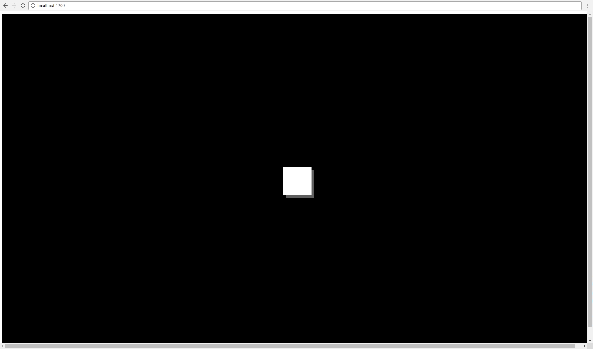

It works!

But wait - there's an ugly white border around our beautiful game canvas. Because Ngine is currently running in a browser window, we still have the browser CSS defaults turned on, including this weird margin. We'll fix that in no time - let's just override the default styling in our `index.html` file:

```html
<head>
...
  <style>
    body { margin: 0; overflow: hidden; }
  </style>
</head>
```

Save `index.html`. If you've still got `ng serve` running, the browser page should refresh as soon as you save with the updates!


Ahh, much better. Hold the space key and watch our "player" move!

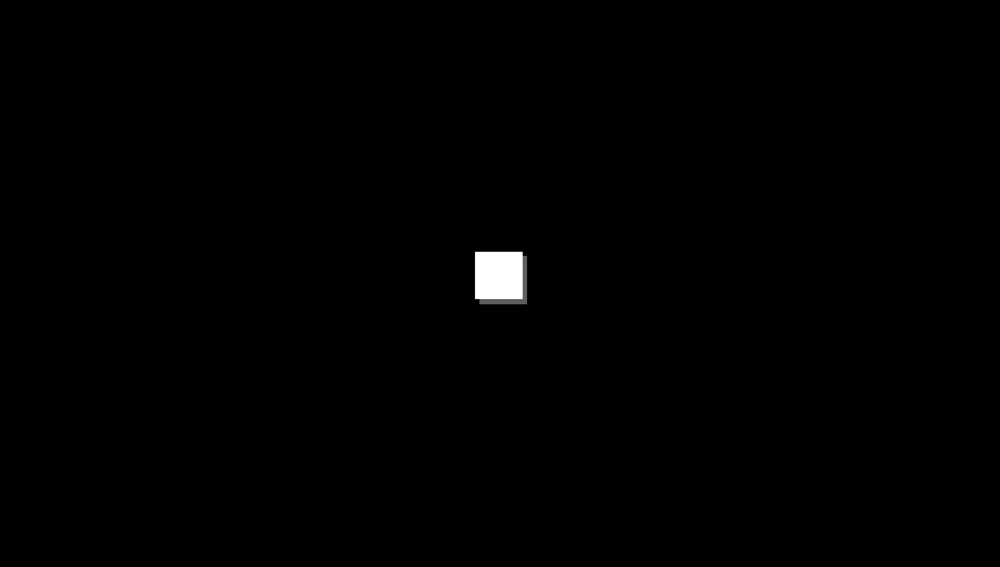

## Dynamically Creating Components

We've made a sprite, we've made it move. Let's do that some more! We'll create a new component that will manage our game obstacles.

> ng g c obstacles -is -it

> #### NOTE:
> This is the short-hand equivalent to the command we ran to generate the player component

Reset the `ObstaclesComponent` decorator like we did with the `PlayerComponent`:

```typescript
import { Component, OnInit } from '@angular/core';

@Component({
  selector: 'app-obstacles',
  template: ``,
})
export class ObstaclesComponent implements OnInit {

  constructor() { }

  ngOnInit() {
  }

}
```

We aren't going to inject `SpriteStyle` here - this component won't be visible in our engine. We'll use it to handle the copies of a new component we're about to create:

> ng g c obstacle -is -it

Let's begin by generating some static obstacles for our player! In `ObstaclesComponent` we're going to use a ComponentFactory to generate ObstacleComponents on the fly. Start by importing and injecting a `CompnentFactoryResolver`. Import `ComponentFactory`, `ViewContainerRef`, `ViewChild`, and `ComponentRef` too, while you're at it.

```typescript
import { ComponentFactoryResolver, ComponentFactory, ViewChild, ViewContainerRef, ComponentRef } from '@angular/core';

export class ObstaclesComponent implements OnInit {

  constructor(
    private resolver: ComponentFactoryResolver,
  ) { }
```

Angular allows us to dynamically create components with ease, provided we follow a few steps:

### 1) Give it an element to attach to

We need to let Angular know where to insert our new components in the component hierarchy. Let's add an `ngine-group` element to our `ObstaclesComponent` template. `ngine-group` is the selector for an empty container component that Ngine declares by default. Add a `#obstacles` attribute to the element. This is the string we can reference to retrieve the element in our component class.

```typescript
@Component({
  ...
  template: `
    <ngine-group #obstacles></ngine-group>
  `,
})
```

Now we'll use the `ViewChild` decorator to query for the `ViewContainerRef` of the `#obstacles` element.

```typescript
export class ObstaclesComponent implements OnInit {
  @ViewChild('obstacles', { read: ViewContainerRef }) obstaclesRef: ViewContainerRef;
}
```

### 2) Create a component factory

Use the `ComponentFactoryResolver` service we injected to create a `ComponentFactory`.

```typescript
import { ObstacleComponent } from '../obstacle/obstacle.component';

export class ObstaclesComponent implements OnInit {
  ...
  private obstacleFactory: ComponentFactory<ObstacleComponent>;

  constructor(
    private resolver: ComponentFactoryResolver,
  ) { }

  ngOnInit() {
    this.obstacleFactory = this.resolver.resolveComponentFactory(ObstacleComponent);
  }
}
```

### 3) Add the component class to entryComponents

Angular "tree-shakes" our applications - it won't include components that we aren't using in the final game build. Since we're dynamically creating our ObstacleComponent, we need to let Angular know that we'll be using it.

Head over to `app.module.ts` and add `ObstacleComponent` to `entryComponents` and `declarations`:

```typescript
import { ObstacleComponent } from './obstacle/obstacle.component';

@NgModule({
  declarations: [
    ObstacleComponent,
  ],
  ...
  entryComponents: [ ObstacleComponent ],
  ...
})
export class AppModule { }
```

### 4) Make the component!

With this setup, creating a component dynamically is a simple method call:

```typescript
const newComponentRef = this.obstaclesRef.createComponent(this.obstacleFactory);
```

Now that that's out of the way, let's finish up our `ObstacleComponent`. This component will be pretty bare-bones - we just need to be able to customize its color, position, and height.

First we'll make an `ObstacleColor` enum and mapping to image assets (included in the zip):

```typescript
export enum ObstacleColor {
  RED,
  ORANGE,
  YELLOW,
  GREEN,
  BLUE,
  PURPLE,
};

const OBSTACLE_COLOR_TO_PATH = {
  [ObstacleColor.RED]: '/assets/img/obstacle_3.png',
  [ObstacleColor.ORANGE]: '/assets/img/obstacle_5.png',
  [ObstacleColor.YELLOW]: '/assets/img/obstacle_4.png',
  [ObstacleColor.GREEN]: '/assets/img/obstacle_1.png',
  [ObstacleColor.BLUE]: '/assets/img/obstacle_2.png',
  [ObstacleColor.PURPLE]: '/assets/img/obstacle_6.png',
};
```

We'll add public methods to be called by our `ObstaclesComponent` class:

```typescript
@Component({
  selector: 'app-obstacle',
  template: ``,
})
export class ObstacleComponent {
  private height: number;
  private type: ObstacleColor;

  constructor(
    @StyleBinding() private style: SpriteStyle,
    private viewport: ViewportService,
    private assets: AssetService,
  ) {}

  setHeight (height: number) {
    this.height = height;
  }

  setFlipped (flipped: boolean) {
    if (flipped) {
      this.style.rotation.y = Math.PI;
    } else {
      this.style.rotation.y = 0;
    }
  }

  setType (type: ObstacleColor) {
    this.type = type;

    this.assets.loadImages([
      { path: OBSTACLE_COLOR_TO_PATH[this.type] }
    ]).subscribe(([image]) => {
      this.style.image = image.style;
    });
  }

  setPosition (position: number) {
    this.assets.loadImages([
      { path: OBSTACLE_COLOR_TO_PATH[this.type] }
    ]).subscribe(([image]) => {
      let pos = Vector.zero()
        .moveX(this.viewport.getWidth() / -2)
        .moveX(image.data.image.width / -2)
        .moveX(position)
        .setY(0)
        .setZ(0);

      if (this.flipped) {
        pos = pos
          .moveY(this.viewport.getHeight() / 2)
          .moveY(image.data.image.height / 2)
          .moveY(this.height * -1);
      } else {
        pos = pos
          .moveY(this.viewport.getHeight() / -2)
          .moveY(image.data.image.height / -2)
          .moveY(this.height);
      }

      this.style.position = pos;
    });
  }
}
```

That's a lot of code, but most of it should be familiar:

* `constructor` - we inject the aforementioned `AssetService` and `SpriteStyle` services. `ViewportService` is new - we can use this service to retrieve the width and height of our game window.
* `setHeight` - simply sets the height attribute of the class
* `setFlipped` - flips our obstacles right side up or upside down (they'll be on both the top and bottom of the screen)
* `setType` - here we'll load in the image matching the color from the `ObstacleColor` enum
* `setPosition` - load in the image again so we can get its width / height to position the sprite correctly. Also use the obstacle's height and the viewport size in the calculation. Depending on the `flipped` option, the obstacle will be positioned at either the top or bottom of the screen.

Head back to `ObstaclesComponent` and add some code that will call these methods. We can access the class of our dynamically created components by referencing the `instance` property of the returned `ComponentRef`.

```typescript
private readonly MAX_HEIGHT = 600; // Maximum height of our obstacles
private readonly MIN_HEIGHT = 300; // Minimum height of our obstacles
private readonly POS_OFFSET = 100; // Spacing between obstacles

private genObstacle (position: number) {
  const ref = this.obstaclesRef.createComponent(this.obstacleFactory);
  // Set the obstacle's color
  ref.instance.setType(this.getRandomObstacleColor());
  // Pick a random height in between MIN_HEIGHT and MAX_HEIGHT
  ref.instance.setHeight(
    Math.floor(Math.random() * (this.MAX_HEIGHT - this.MIN_HEIGHT + 1) + this.MIN_HEIGHT)
  );
  // Set the obstacle's position in the game world
  ref.instance.setPosition(position);

  return ref;
}

// Generates a number corresponding to a color item of our enum (e.g. i=1 : ObstacleColor.ORANGE) 
private getRandomObstacleColor (): ObstacleColor {
  const i = Math.floor(Math.random() * (5 + 1));
  return i;
}
```

Lets generate one of these components and admire our handywork:

```typescript
ngOnInit() {
  this.genObstacle(100);
}
```

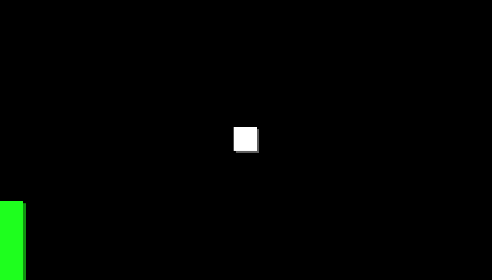

Cool beans! Refresh the browser window and the color and height of the obstacle should change.

Now we want to generate enough obstacles to fill the screen:

```typescript
private obstacles: ComponentRef<ObstacleComponent>[] = [];

ngOnInit() {
  const numObstacles = Math.ceil(this.viewport.getWidth() / this.POS_OFFSET) + 10;
  for (let i = 0; i < numObstacles; i++) {
    this.obstacles.push(this.genObstacle(i * this.POS_OFFSET));
  }
}
```

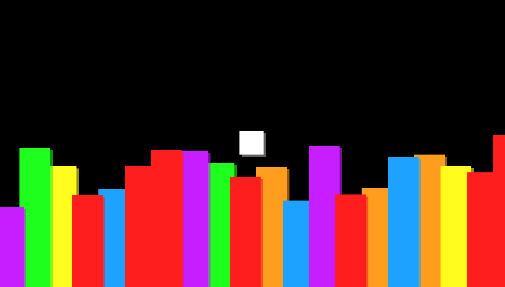

Whoa, that was easy! We may want to tweak some numbers, but that's not a bad start!

We want to give our terrain the appearance of being unending (given that this is an endless runner). We'll use some fancy observable magic to get the job done.

First inject the `ClockService` - we want our obstacles to move on every frame:

```typescript
constructor(
  private clock: ClockService,
) { }
```

We'll maintain a game time using the `.scan` operator.

```typescript
ngOnInit() {
  const timer$ = this.clock.tick.scan((x) => x + 1, 0);
}
```

The `timer$` observable will emit the current frame number once every frame `0, 1, 2, 3, ...`

Every time the camera moves all the way past one obstacle, we'll want to destroy it and make another to take its place.

```typescript
private readonly MOVE_AMOUNT = 5;

ngOnInit() {
  timer$
    .filter((x) => (x * this.MOVE_AMOUNT) % this.POS_OFFSET === 0)
    .scan((x) => x + 1, numObstacles - 1)
    .subscribe((blockNum) => {
      this.obstacles.shift().destroy();
      this.obstacles.push(
        this.genObstacle(blockNum * this.POS_OFFSET)
      );
    });
}
```

This code might look intimidating at first, but it's really quite simple. We `filter` our `timer$` events - we only want the frame events that happen when we move past an obstacle. We'll be moving `MOVE_AMOUNT` units per frame, so we mod the amount of movement we've done by the obstacle offset to only emit an event at frame `0, 20, 40, 60...` We use the same `.scan` operator from before to maintain a count of how many obstacles we've made - this time we give it a seed of `numObstacles`. Finally, we `subscribe` to these events so that the code in the `subscribe` block gets executed once per event. We'll `.destroy` the first component in our `obstacles` list, and generate a new one at the most recent position.

Finally, let's inject the `CameraService`. We'll use this service to manipulate the game's cameras.

```typescript
import { Vector, CameraService } from '@ngine/core';

constructor(
  private camera: CameraService,
) { }

ngOnInit() {
  ...
  timer$
    .subscribe((time) => {
      this.camera.getActive().setPosition(new Vector(time * this.MOVE_AMOUNT, 0));
    });
}
```

Call `CameraService::getActive` to get the default camera object. We'll update its position once every frame to a new `Vector` position based on our `MOVE_AMOUNT`.

Alright, let's give it a whirl:

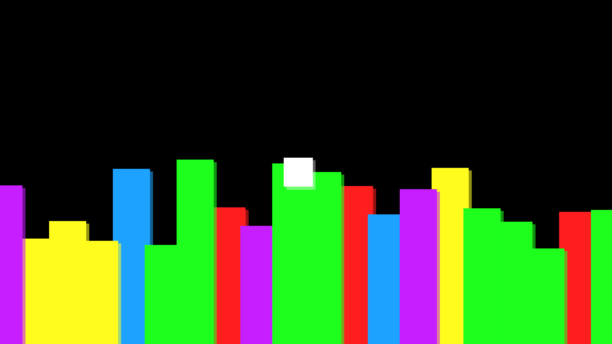

Looks great! We want obstacles at the top and bottom of the screen, though. This is where the power of Angular really starts to shine - we can just repurpose our existing Obstacles component!

Import the `Input` decorator from Angular in `obstacles.component.ts`:

```typescript
import { Input } from '@angular/core';
```

Whenever we reference our component's element selector, we can use `@Input` to take options. In this case, we want to have a boolean option for whether our obstacles will be on the top or bottom of the screen:

```typescript
export class ObstaclesComponent implements OnInit {
  @Input() flipped: boolean;
  ...
}
```

Based on this `flipped` value, we'll want to `setFlipped` for our generated `ObstacleComponents` appropriately:

```typescript
  private genObstacle (position: number) {
    const ref = this.obstaclesRef.createComponent(this.obstacleFactory);
    ...
    ref.instance.setFlipped(this.flipped);
    ...
  }
```

Now all we need to do is create a second copy of our obstacles component for the top! Head over to `app.component.ts` and add another `<app-obstacles>`. We'll configure one with `flipped = true` and the other with `flipped = false`.

```typescript
@Component({
  selector: 'app-root',
  template: `
    <app-player></app-player>
    <app-obstacles [flipped]="true"></app-obstacles>
    <app-obstacles [flipped]="false"></app-obstacles>
  `,
})
export class AppComponent {}
```

Refresh!

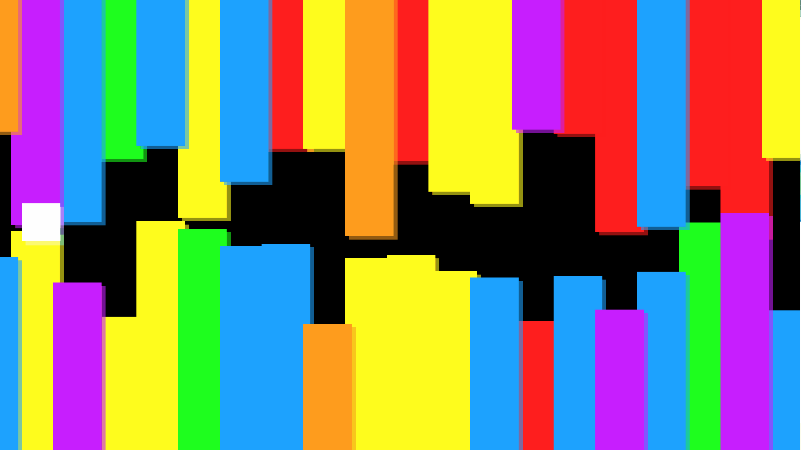

## Relative Units

Things are looking a little crowded, huh? We could just adjust the `MIN_HEIGHT` and `MAX_HEIGHT` options we created before, but that would result in inconsistent display depending on the size of our viewport.

This is a common design decision that must be made with scalable games - how will varying screen sizes affect balance and player experience?

Ngine provides a few tools to help with this - the one we'll use in this tutorial is **relative units**.

Let's use the `ViewportService` to make our obstacle heights based on a percentage of the size of the viewport. First we'll head over to `obstacles.component.ts` and change our height generation - we want it to be a percentage of the overall height of the viewport now, not a fixed-size integer:

```typescript
private readonly MAX_HEIGHT = 0.4; // Maximum height of our obstacles
private readonly MIN_HEIGHT = 0.05; // Minimum height of our obstacles
...
private genObstacle (position: number) {
    const ref = this.obstaclesRef.createComponent(this.obstacleFactory);
    ...
    ref.instance.setHeight(
      Math.random() * (this.MAX_HEIGHT - this.MIN_HEIGHT) + this.MIN_HEIGHT
    );

    return ref;
  }
```

Then we'll update our obstacle component to use `ViewportService::relativeY` units:

```typescript
      if (this.flipped) {
        pos = pos
          .moveY(this.viewport.getHeight() / 2)
          .moveY(image.data.image.height / 2)
          .moveY(this.viewport.relativeY(this.height) * -1);
      } else {
        pos = pos
          .moveY(this.viewport.getHeight() / -2)
          .moveY(image.data.image.height / -2)
          .moveY(this.viewport.relativeY(this.height));
      }
```

Finally, we want our "player" to be relatively sized as well:

```typescript
  private readonly RELATIVE_SIZE = 0.05;

  ngOnInit() {
    ...
    this.assets
      .loadImages([ { path: '/assets/img/player.png' } ])
      .subscribe(([playerImage]) => {
        ...
        const size = this.viewport.relativeY(this.RELATIVE_SIZE) /
            playerImage.data.image.height;
        this.style.scale = this.style.scale.setX(size).setY(size);
        ...
      });
  }
```
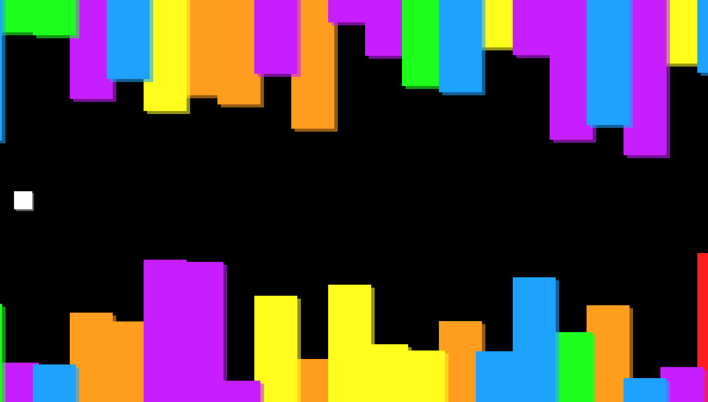
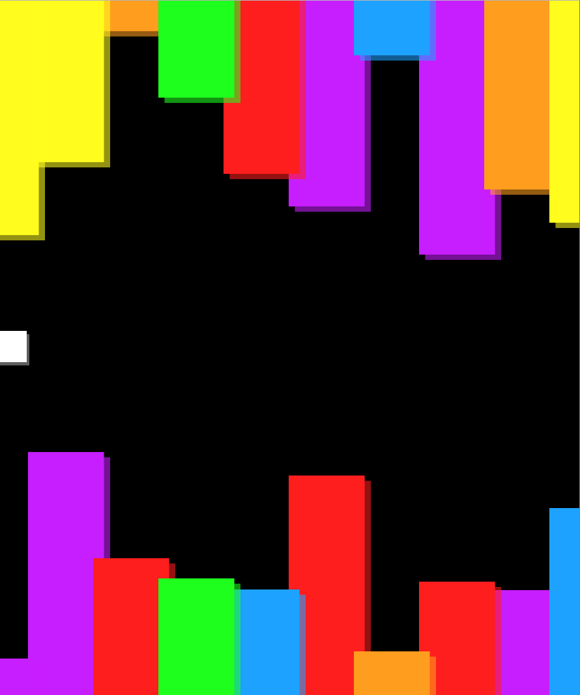

Great! Now we aren't at risk of giving some of our players unfair advantages!

## Let's Move

Right now we have the speed of our obstacle / camera movement hard-coded. That's alright for debugging, but ultimately we want this to be dynamic so that our game increases in difficulty over time. Additionally, our player is falling off the edge of the camera, so clearly they'll need to move as well. This begs the question - which component should be responsible for maintaining the speed of our game?

One might be able to make an argument for the `AppComponent`, but it's possible that we'll want to have the speed accessible in other sibling components, like the UI. When there's no clear ownership over a piece of information in an Ngine game, it's a good indication that you'll want to create a **service**.

We've already been using Ngine-provided services throughout this tutorial: `CameraService`, `ViewportService`, and `AssetService` are just classes that Ngine creates to share between the components of your game!

Let's make our own:

> ng g s Level

This should create `level.service.ts` and `level.service.spec.ts`. First thing's first, you'll see a message that looks something like this:

> WARNING Service is generated but not provided, it must be provided to be used

Angular CLI is reminding us that in Angular, if a service is going to be injected it must first be **provided**. We do that by heading over to `app.module.ts`, importing our service class, and adding `LevelService` to our list of `providers`:

```typescript
import { LevelService } from './level.service';

@NgModule({
  ...
  providers: [
    LevelService
  ],
})
export class AppModule { }
```

This alerts Angular to the existence of our injectable class. Now we can head to our `PlayerComponent` and `ObstaclesComponent` classes and inject the `LevelService`!

```typescript
constructor(
  ...
  private level: LevelService,
) { }
```

First thing's first, let's get the `LevelService` controlling the camera instead of the `ObstaclesComponent`. Rather than having it move at a constant rate, we've decided we want the level to move faster the longer we survive. We can use observables to give us that behavior.

```typescript
@Injectable()
export class LevelService {

  private readonly INCREASE_AMOUNT = 2;   // How much to increase the speed by
  private readonly INCREASE_EVERY = 200;  // Increase speed every x moves
  private readonly BASE_SPEED = 5;        // Starting speed

  public position$: Observable<number>;   // Current camera position

  constructor(
    private clock: ClockService,
    private camera: CameraService,
  ) {
    const timer$ = this.clock.tick
      .scan((x) => x + 1, 0);

    const speed$ = timer$
      .filter((x) => x % this.INCREASE_EVERY === 0)
      .map((x) => Math.floor(x / this.INCREASE_EVERY) * this.INCREASE_AMOUNT + this.BASE_SPEED)
      .startWith(this.BASE_SPEED);

    this.position$ = timer$
      .withLatestFrom(speed$)
      .scan((prev, [time, speed]) => prev + speed, 0);
  }
```

This code is pretty simple. We define some `readonly` constants at the top which control the level speed. Using our familiar `ClockService::tick` observable and `.scan` operator, we create `timer$`, just like in `ObstaclesComponent`. `speed$` emits an event every `INCREASE_EVERY` events, signaling an increase in speed. This speed is calculated from the `INCREASE_AMOUNT` and the `BASE_SPEED`, and will start with the `BASE_SPEED`. Finally, our `LevelService::position$` takes the latest `speed$` value and adds it to our current position, starting at 0.

Keep in mind that `position$` is a so-called "cold observable", meaning it only starts emiting events once we `subscribe` to it. Lets write a method, `startGame`, that can be called by whatever component initiates the game. When it's called we'll start moving the camera.

```typescript
  startGame () {
    this.position$.subscribe((position) => {
      this.camera.getActive().setPosition(
        new Vector(position, 0)
      );
    });
  }
```

Since `AppComponent` is the root component of our game, it makes sense that it would trigger the game's start:

```typescript
export class AppComponent {
  constructor (
    private level: LevelService,
  ) {}

  ngOnInit () {
    this.level.startGame();
  }
}
```

Awesome! Using the `position$` observable, which is publicly available on our `LevelService`, we can have the `PlayerComponent` move with the camera so that it stays in the center of the screen:

```typescript
  ngOnInit() {
    this.level.position$.subscribe((x) => {
      this.style.position.x = x;
    });
  }
```

We're only partway done with our refactor. We need to remove any ties that `ObstaclesComponent` has to `CameraService` and `ClockService`. Let's create a second public observable on `LevelService`, `obstacles$`, that will emit an event whenever `ObstaclesComponent` should create a new obstacle.

```typescript
@Injectable()
export class LevelService {

  ...
  private readonly OBSTACLE_OFFSET = 100; // Spacing between obstacles
  public readonly NUM_OBSTACLES = Math.floor(this.viewport.getWidth() / this.OBSTACLE_OFFSET) * 2;

  ...
  public obstacles$: Observable<number>;

  constructor(
    ...
    private viewport: ViewportService,
  ) {
    ...
    const startingObstacles = Array(this.NUM_OBSTACLES).fill(0).map((_, i) => {
      return i * this.OBSTACLE_OFFSET;
    });

    this.obstacles$ = this.position$
      .withLatestFrom(speed$)
      .filter(([x, speed]) => x % this.OBSTACLE_OFFSET < speed)
      .scan((x) => x + 1, this.NUM_OBSTACLES)
      .map((obstacleNum) => (obstacleNum - 1) * this.OBSTACLE_OFFSET)
      .startWith(...startingObstacles);
  }
}
```

You might have noticed that we borrowed some code from `ObstaclesComponent` for this code snippet. Using our `OBSTACLE_OFFSET` constant, relocated from `ObstaclesComponent`, we emit an `obstacles$` event whenever our `position$` has moved past an obstacle. We calculate and emit the position of the new obstacle we'll create, just like before.

One new addition is the `startingObstacles`. We create an array that is `LevelService::NUM_OBSTACLES` items long and set the positions of these first few obstacles manually. Using the handy `.startWith` operator, we can have these obstacles be emmitted all at once, right at the start of our observable. This eliminates the need for the `genObstacle` for loop in `ObstaclesComponent`.

Let's fix `ObstaclesComponent` now:

```typescript
  ngOnInit() {
    this.obstacleFactory = this.resolver.resolveComponentFactory(ObstacleComponent);

    this.level.obstacles$
      .subscribe((position) => {
        this.obstacles.push(
          this.genObstacle(position)
        );

        if (this.obstacles.length > this.level.NUM_OBSTACLES) {
          this.obstacles.shift().destroy();
        }
      });
  }
```

Notice we made `NUM_OBSTACLES` public and referenced it in the subscription so that `ObstaclesComponent` won't start destroying obstacles until it's supposed to.

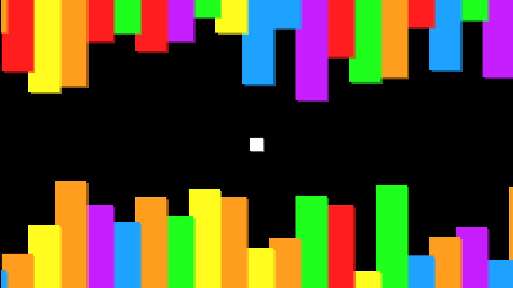

Sweet! Just like before, but now our player is following the camera movement and it speeds up! This is the power of services in action - our injectable class has ownership over our game's common data.

## Improving Terrain Generation

Right now our obstacles are pretty stale - a player could stay in the center of the screen forever and never lose! We'll extend `LevelService` to generate heights for obstacles using some basic algorithms.

#### The Strategy

A common way to generate terrain dynamically in endless runners is to create quadratic curves for the player to follow. This works well when a player's sprite falls in a "gravity-esque" fashion.

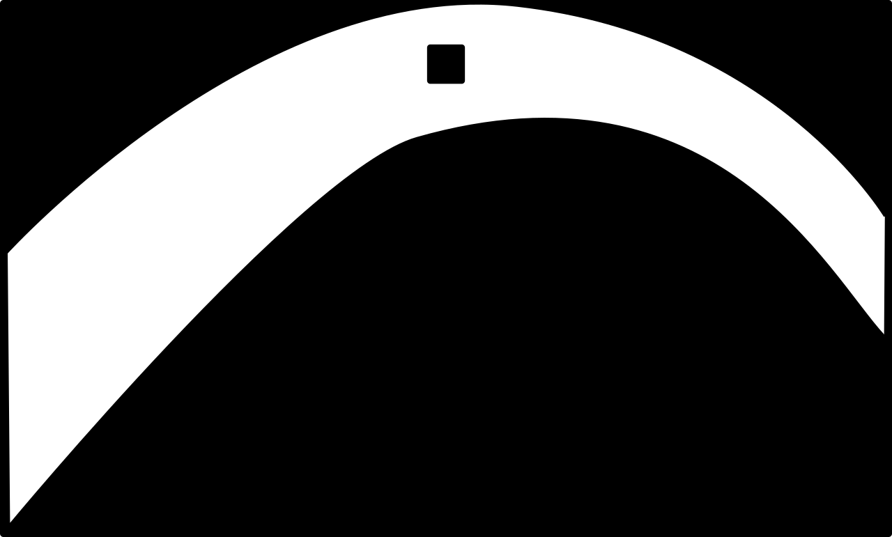

While we want this terrain to be created randomly, we'll start each run with a flat tunnel so the player has some time to prepare.

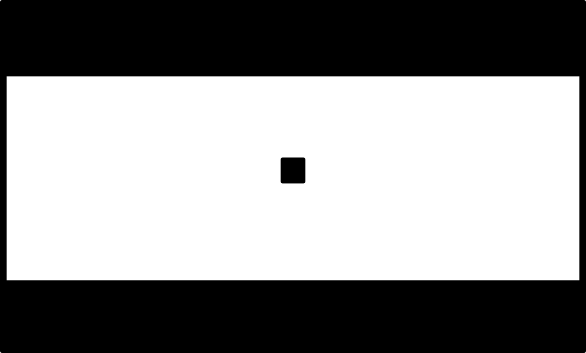

We're going to dump a bunch of code here, but don't be alarmed - rest assured it will be followed by detailed explanation.

---

```typescript
@Injectable()
export class LevelService {
  ...
  // These are all viewport-relative units
  private readonly MAX_VELOCITY = 0.05;
  private readonly NEXT_ACCELERATION_MIN = 10;
  private readonly NEXT_ACCELERATION_MAX = 40;
  private readonly MAX_ACCELERATION = 0.02;
  private readonly MIN_ACCELERATION = -0.02;

  private readonly MAX_GAP = 0.5;
  private readonly MIN_GAP = 0.3;
  private readonly STARTING_GAP = 0.5;
  private readonly START_HEIGHT = 0.5;
  private readonly OBSTACLE_PADDING = 0.05;

  constructor(...) {
    ...
    const terrainAcceleration$ = Observable.of(null)
      .concatMap(() => {
        return timer$
          .skip(Math.floor(this.randomNum(
            this.NEXT_ACCELERATION_MIN,
            this.NEXT_ACCELERATION_MAX
          )))
          .first();
      })
      .repeat()
      .map(() => this.randomNum(this.MIN_ACCELERATION, this.MAX_ACCELERATION));

    const terrainHeight$ = this.accelerateify(
      obstaclePos$,
      terrainAcceleration$,
      this.MAX_VELOCITY,
      0.1,
      0.9,
      this.START_HEIGHT,
    ).startWith(this.START_HEIGHT);

    const gapHeight$ = this.accelerateify(
      obstaclePos$,
      terrainAcceleration$,
      this.MAX_VELOCITY,
      this.MIN_GAP,
      this.MAX_GAP,
      this.STARTING_GAP
    )
    .startWith(this.STARTING_GAP);

    const startingObstacles = Array(this.NUM_OBSTACLES).fill(0).map((_, i) => {
      return [
        new Vector(i * this.OBSTACLE_OFFSET, this.START_HEIGHT - this.STARTING_GAP / 2),
        new Vector(i * this.OBSTACLE_OFFSET, this.START_HEIGHT + this.STARTING_GAP / 2),
      ];
    });

    this.obstacles$ = obstaclePos$
      .withLatestFrom(terrainHeight$, gapHeight$)
      .map(([obstaclePos, terrainHeight, gapHeight]) => {
        console.log(terrainHeight, gapHeight);
        return [
          // Bottom
          new Vector(
            obstaclePos,
            Math.max(terrainHeight - (gapHeight / 2), this.OBSTACLE_PADDING)
          ),
          // Top
          new Vector(
            obstaclePos,
            Math.min(terrainHeight + (gapHeight / 2), 1 - this.OBSTACLE_PADDING)
          ),
        ];
      })
      .share()
      .startWith(...startingObstacles);
  }

  randomNum (min, max) {
    return Math.random() * (max - min) + min;
  }

  accelerateify (
    tick$: Observable<any>,
    accelerate$: Observable<number>,
    maxVelocity: number,
    minPosition: number = null,
    maxPosition: number = null,
    startPos: number = 0,
  ) {
    const velocity$ = tick$
      .withLatestFrom(accelerate$)
      .scan((prev, [tick, acceleration]) => {
        return Math.max(
          Math.min(prev + acceleration, maxVelocity),
          maxVelocity * -1
        );
      }, 0);

    return velocity$
      .scan((prev, velocity) => {
        let position = prev + velocity;
        if (minPosition !== null) {
          position = Math.max(position, minPosition);
        }
        if (maxPosition !== null) {
          position = Math.min(position, maxPosition);
        }
        return position;
      }, startPos);
  }
}
```

In effect, you can envision our algorithm as a point moving up and down over time with acceleration - this point defines the height of our curves. We'll refer to this imaginary point as the **terrain drawer**. The terrain drawer defines the center of the "tunnel" our player travels through, where the "tunnel" is the space in between the top and bottom obstacles. In addition to finding the tunnel's center point, we also need to compute its height (the gap between the top and bottom boundaries of the obstacles). The center, less half the gap, defines the bottom boundary position, and the center, plus half the gap, defines the top boundary position.

`terrainAcceleration$` begins with an `Observable.of(null)` (we don't actually use this event, we just need an arbitrary value to start our observable). `.concatMap` is an operator that will wait for a returned observable to complete before beginning the next one. The observable we give `.concatMap` here is a modified `timer$`, which waits a random number of ticks (between `NEXT_ACCELERATION_MIN` and `NEXT_ACCELERATION_MAX`) before completing. Combined with the `.repeat` operator, this operator combination will wait a random number of ticks, emit an event, wait a random number of ticks, emit an event, and so on. Whenever these events occur, we want to change the acceleration of our terrain drawer. We'll pick a `randomNum` between `MIN_ACCELERATION` and `MAX_ACCELERATION`.

The helper method `accelerateify` returns an observable that emits a position value every `tick$` event. We can configure it with a capped velocity via `maxVelocity`, a minimum position using `minPosition` and a maximum position using `maxPosition`. It will begin moving from `startPos`.

`terrainHeight$` uses the `accelerateify` helper to emit an event that corresponds to the terrain drawer's position. Note that we only update our position on an `obstaclePos$` event (only when an obstacle passes, not on every tick). We also set the intial position to `START_HEIGHT` so that our randomly generated terrain will connect seamlessly with the flat tunnel at the beginning of a run.

`gapHeight$` uses `accelerateify` as well. Notice it reuses `terrainAcceleration$` - we also want our "gap drawer"'s acceleration to update at random intervals.

We changed `observable$` so that it emits a pair of `Vector`s. The x-coordinate for both will correspond to the same horizontal position as before. The y-coordinate for each `Vector`, however, will correspond to the block's calculated height. Note that we have a pair - the first `Vector` in the array will be the "bottom" obstacle's position, while the second `Vector` will correspond to the "top". Per this change, we've updated `startingObstacles` to emit a pairs of vectors for the first `NUM_OBSTACLES`.

At last, we can put everything together. `LevelService::obstacles$` takes the latest x-positions, terrain heights, gap heights, and calculates the top and bottom obstacle positions. The `max` and `min` serve to ensure that, should the computed positions go off screen, our obstacles will remain visible at `OBSTACLE_PADDING` height.

There's one last crucial piece to this puzzle - the `.share` operator. This handy transformation means that anyone who `subscribes` to the `obstacles$` observable will receive the same exact events. This is important because we have two `ObstaclesComponents`. Without this operator, each would get different `Vector` pairs and be liable to overlap terrain in nonsensical ways.

---

Whew. That was a lot of work. We're not done yet, however. Let's update `ObstaclesComponent` to use our new code.

```typescript
  ngOnInit() {
    this.obstacleFactory = this.resolver.resolveComponentFactory(ObstacleComponent);

    this.level.obstacles$
      .map(([bottom, top]) => (this.flipped) ? top : bottom) // New line
      .subscribe((position) => {
        this.obstacles.push(this.genObstacle(position));
        if (this.obstacles.length > this.level.NUM_OBSTACLES) {
          this.obstacles.shift().destroy();
        }
      });
  }
Notice the addition of .map to pull the appropriate top or bottom Vector from our Vector pair.

  private genObstacle (position: Vector) {
    const ref = this.obstaclesRef.createComponent(this.obstacleFactory);
    ref.instance.setType(this.getRandomObstacleColor());
    ref.instance.setHeight(position.y);
    ref.instance.setFlipped(this.flipped);
    ref.instance.setPosition(position.x);

    return ref;
  }
```

We don't need to generate our heights randomly anymore!

One significant change we made in our height generation is that the heights for both the top and bottom obstacles are relative to the bottom of the screen now (before, the top obstacles were positioned relative to the top of the screen).

That's an easy fix to `ObstacleComponent`:

```typescript
  setPosition (position: number) {
    this.assets.loadImages([
      { path: OBSTACLE_COLOR_TO_PATH[this.type] }
    ]).subscribe(([image]) => {
      let pos = Vector.zero()
        .moveX(this.viewport.getWidth() / -2)
        .moveX(image.data.image.width / -2)
        .moveX(position)
        .setY(0)
        .moveY(this.viewport.getHeight() / -2)
        .moveY(this.viewport.relativeY(this.height))
        .setZ(0);

      if (this.flipped) {
        pos = pos.moveY(image.data.image.height / 2);
      } else {
        pos = pos.moveY(image.data.image.height / -2);
      }

      this.style.position = pos;
    });
```

Alright, the moment of truth:


It's worth noting that we aren't under any requirement to express terrain generation in terms of observables. Ngine and Angular don't care. It's recommended you do so anyway, however. Once you've put forth the intial effort to understand the "language" of Reactive programming, you'll find expressing event-based behaviors much, much easier. Reactive programming also promises easier debugging, better state management, simpler testing, and more. Additionally, you can:

1) Better interface with Ngine services, which return observables when appropriate
2) Put Angular into a hyper-optimized Change Detection mode which can give your games a performance edge
Make it a Game

Our player is disappointingly static. Luckily, it's not hard to get them moving.

```typescript
  private readonly RELATIVE_SIZE = 0.025; // Tweak this to fit our terrain generation
  private readonly ACCELARATION = 0.001;
  private readonly MAX_VELOCITY = 0.01;
  private readonly GRAVITY = -0.001;

  ngOnInit() {
    ...
    const acceleration$ = Observable.merge(
      this.keys.keyDown.get('space').map(() => this.ACCELARATION),
      this.keys.keyUp.get('space').map(() => this.GRAVITY)
    ).startWith(this.GRAVITY);

    const position$ = this.level.accelerateify(
      this.clock.tick,
      acceleration$,
      this.MAX_VELOCITY,
      -0.5,
      0.5,
      0
    );

    position$.subscribe((position) => {
      this.style.position.y = this.viewport.relativeY(position);
    });
  }
```

We'll reuse that delightful `accelerateify` to give our player some interesting movement. Since `0` correponds to the center of the screen for our player sprite, we make our max and min position `0.5` and `-0.5` respectively.

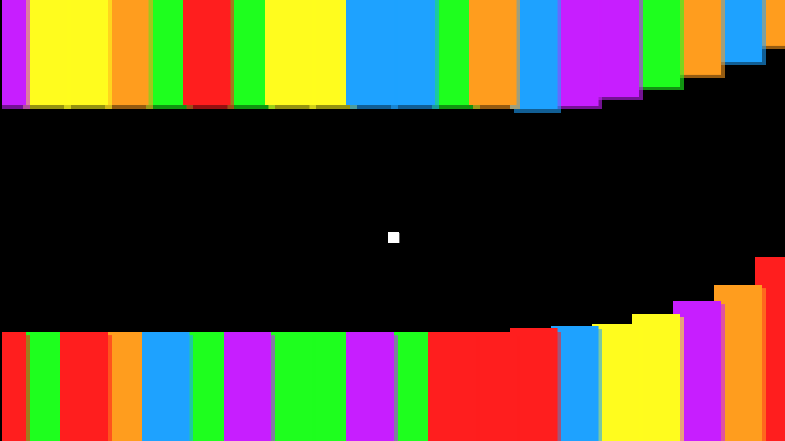

## Collision

We can't lose! Whenever we hit the terrain, our run should end immediately.

Every time we update our player's position, we'll check for collisions against the last `NUM_OBSTACLES` obstacles:

```typescript
    this.level.position$
      .map((x) => x + this.viewport.relativeX(0.5))
      .withLatestFrom(
        position$.map((x) => x + 0.5),
        this.level.obstacles$.scan((acc, current) => {
          return [...acc, current].slice(this.level.NUM_OBSTACLES * -1);
        }, [])
      )
      .filter(([positionX, positionY, obstacles]) => {
        const matches = obstacles.filter(([bottomObstacle, topObstacle]) => {
          return (
            positionX > bottomObstacle.x &&
            positionX < (bottomObstacle.x + this.level.OBSTACLE_OFFSET)
          ) && (
            positionY < (bottomObstacle.y) ||
            positionY > (topObstacle.y)
          );
        });
        return matches.length > 0;
      })
      .subscribe(() => {
        this.level.gameOver();
      });
```

Our player is operating in a slightly different coordinate space from the obstacles, so we use `.map` to normalize them (player `0` -> obstacle `0.5`). We use `.scan` to emit a buffer of the last `NUM_OBSTACLES` obstacles, then run a filter over those obstacles to check for collisions. If we find a match in our buffer, the game should end.

Let's write `LevelService::gameOver`. Here, the power of observables will once again shine. We're going to create `gameOver$` which will be a **Subject**. A subject is just an observable that we can manually emit values for. In `level.service.ts` add:

```typescript
  public gameOver$: any = new Subject<boolean>();
  ...
  gameOver () {
    this.gameOver$.next(true);
  }
```

Whenever our player calls `LevelService::gameOver` we'll emit an event on our subject. Using this subject, we can easily terminate any observables that we need to. For instance, we'll modify `LevelService::position$` just slightly:

```typescript
     this.position$ = timer$
      .withLatestFrom(speed$)
      .scan((prev, [time, speed]) => prev + speed, 0)
      .takeUntil(this.gameOver$); // New line
```
Lets see what that did:

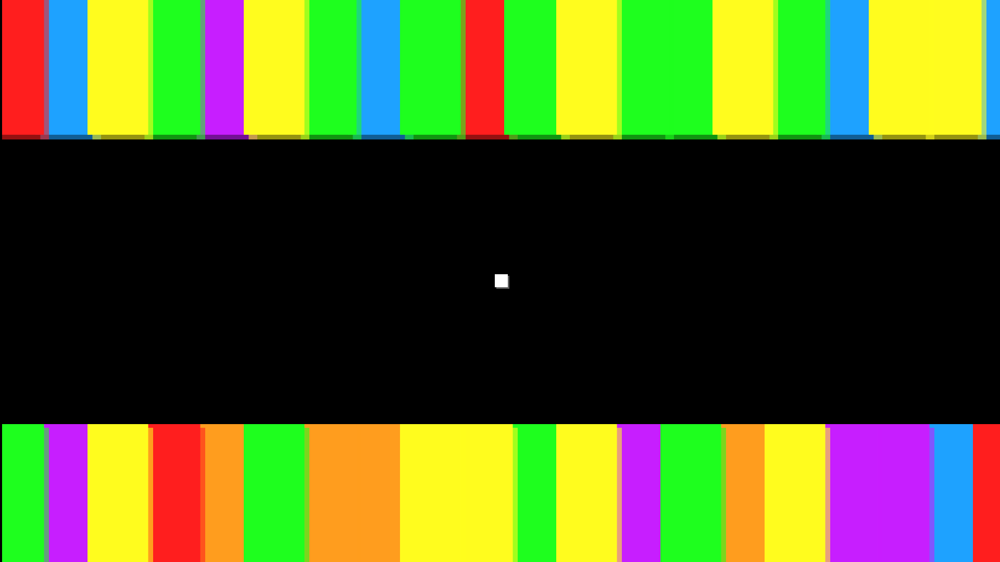

Whoa! Just like that, all of our `position$`-dependent subscriptions are terminated! All that with a one-line change! Let's also suspend our player's falling:

```typescript
    position$
      .takeUntil(this.level.gameOver$) // New line
      .subscribe((position) => {
        this.style.position.y = this.viewport.relativeY(position);
      });
```

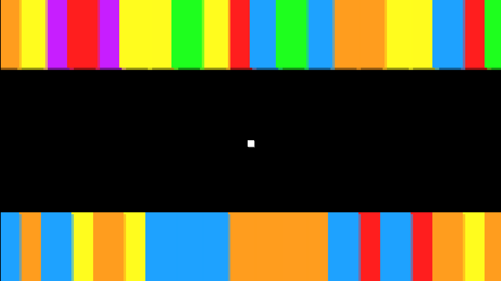

Easy peasy!

## Making a GUI

Last but not least, we want our players to have a score and some sort of "game over" screen. Since our Ngine game is browser-based we'll just use HTML for our GUI!

> #### NOTE:
> Ngine is renderer-agnostic, which means it can be used with non-web based renderers. For instance, someone could write a Cocos2d Ngine middleware to run a game natively on iOS. If this were the case, we wouldn't be able to create GUIs using HTML. Since we're using Three.js in this tutorial, however, we know we'll always be executing our game in a browser environment.

> #### NOTE:
> The preferred way to include a UI in an Ngine game is using the Angular `DomRendererFactory2` class and HTML-based components within your existing application. Unfortunately, at the time of writing this tutorial Angular does not properly support multiple component renderers within a single application (Ngine replaces `DomRendererFactory2` with its own custom component renderer).
>
> There are hacks to work around this (for instance, [Lazy Loading](https://angular-2-training-book.rangle.io/handout/modules/lazy-loading-module.html) a UI module), but they are complex and outside the scope of this tutorial.

We'll keep things really simple. Update `index.html` as follows:

```html
<head>
  ...
  <link href="https://fonts.googleapis.com/css?family=PT+Mono" rel="stylesheet">
  <style>
    ...
    #ui {
      position: absolute;
      top: 1rem;
      left: 1rem;
      font-size: 48px;
      color: white;
      font-family: 'PT Mono', monospace;
      background-color: rgba(0,0,0,0.75);
      padding: 1rem;
      z-index: 50;
    }

    #game-over {
      font-family: 'PT Mono', monospace;
      font-size: 72px;
      position: absolute;
      left: 50%;
      top: 50%;
      transform: translate(-50%, -50%);
      z-index: 50;
      color: white;
      display: none;
      background-color: rgba(0,0,0,0.75);
      padding: 2rem;
    }
  </style>
</head>
<body>
  <app-root>Loading...</app-root>
  <div id="score">0</div>
  <div id="game-over">GAME OVER</div>
</body>
</html>
```

We create a div element to hold the score with `id="score"` and another to hold the game over text with `id="game-over"`. We position these on the screen using `top`, `left`, and `position: absolute`, making sure they display on top of the canvas with `z-index: 50`. We also customize their text and background so they'll be easy to see. To add a little personality, we use the [PT Mono Google Web Font](https://fonts.google.com/specimen/PT+Mono) (it's free and open source). `#game-over` is hidden at the start using `display: none`.

In our `LevelService` we add two subscriptions to `startGame`.

```typescript
  startGame () {
    ...
    this.position$
      .subscribe((score) => {
        document.getElementById('score').innerText = score;
      });

    this.gameOver$
      .subscribe(() => {
        document.getElementById('game-over').style.display = 'block';
      });
  }
```
That's it!

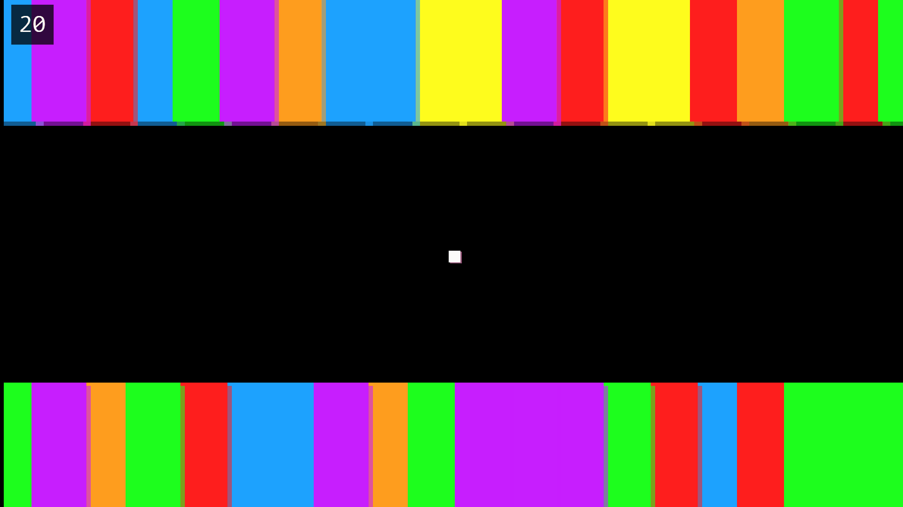

## Potential Improvements

We barely scratched the surface of Ngine's power in this tutorial. We'll leave the following improvements as exercises to the reader, though we may implement them in subsequent tutorials:

* Play again button from the "Game Over" screen.
* Sound effects and background music
* Improved difficulty scaling (gap steadily shrinks over time, for instance)
* High-score list
* Death animation
* Distribute as desktop application
* Distribute as mobile application
